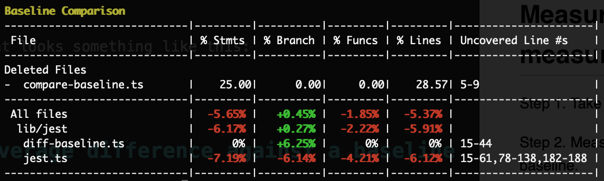

# Campsite

## The Pitch
Have you ever heard of a Boy Scout Rule that says

```
   "Try and leave this world a little better than you found it."
```

You can also apply this rule in software development as well. Here is another quote from Uncle Bob:

```
   "Always leave the code you're editing a little better
than you found it."
```

Then you might ask question, *__How do I know when I am editing the code if I have made it better or worse?__*


```
   Have we made our test coverage better or have we made it worse than before?
```

__Campsite__ provides you the ability to compare unit test coverage against a baseline (*"code when you found it"*) and shows you exactly that.

# Installation
Lets install `campsite` globally.

```
npm install @nexxspace/campsite jest
```

# How it works

1. Before you begin making your change in the code. Lets save a baseline of the current code.

   ```
	campsite --baseline
   ```
   
   This creates a `json` file capturing coverage statistics generated by `jest`.
   
1. Make your code change. Don't forget to add some unit tests :)

1. Now, lets compare your change against the baseline we saved earlier in (1).

   ```
	campsite
   ```
   
   This produces a report that looks something like this:
   
   
1. __campsite__ shows us areas:
   - we made some improvements. The "+" (in green)
   - we made it worse. The "-" (in red) .
